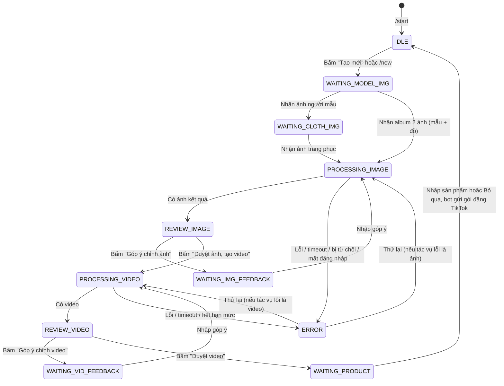

# Kế Hoạch Triển Khai Telegram Bot: Virtual Try-On & Video AI (Gemini Web) → TikTok Affiliate

Tài liệu mô tả kiến trúc, luồng hội thoại, cấu trúc thư mục, cấu hình prompt và lộ trình xây dựng bot Telegram cá nhân: từ ảnh người mẫu + ảnh trang phục → ảnh thử đồ → video 9:16 → gói nội dung sẵn sàng đăng TikTok kèm sản phẩm affiliate.

---

## 1. Tổng Quan

### 1.1 Các Quyết Định Đã Chốt

| Hạng mục | Quyết định | Hệ quả thiết kế |
| :--- | :--- | :--- |
| **Người dùng** | Cá nhân, chỉ 1 người | Whitelist 1 Telegram `user_id`; xử lý tuần tự, không cần hàng đợi phức tạp. |
| **Nơi chạy bot** | Máy Windows cá nhân; điều khiển qua app Telegram trên điện thoại | Long polling (không cần IP public/webhook); máy phải bật và không ngủ khi dùng. |
| **Engine ảnh + video** | Tự động hóa web `gemini.google.com` bằng gói Gemini Pro sẵn có | Không dùng Gemini API → không tốn phí theo lượt, nhưng phụ thuộc giao diện web và có rủi ro ToS với tài khoản Google (xem mục 10). |
| **Tỉ lệ video** | 9:16 | Ảnh thử đồ cũng sinh ở 9:16 ngay từ đầu để video không bị cắt khung. |
| **Đăng TikTok** | Bán tự động — bot **không** tự đăng | Không đụng tới tài khoản TikTok. Bot gửi file video gốc + caption + thông tin sản phẩm; người dùng tự đăng trên app TikTok và gắn sản phẩm. |
| **Đã kiểm chứng thủ công** | Thử đồ, tạo video trên Gemini web, đăng TikTok + gắn sản phẩm | Rủi ro còn lại nằm ở phần **tự động hóa** Gemini web → làm spike trước tiên (Giai đoạn 0). |

### 1.2 Tech Stack

| Thành phần | Công nghệ / Thư viện | Ghi chú |
| :--- | :--- | :--- |
| **Ngôn ngữ** | Python 3.11+ | async/await cho cả Telegram lẫn Playwright trên cùng event loop. |
| **Telegram** | `python-telegram-bot` v21+ (async) | `ConversationHandler`, Inline Keyboard, handler `block=False` cho tác vụ dài. |
| **Tự động hóa Gemini web** | `playwright` (async) + Google Chrome thật | Kết nối qua CDP tới Chrome chạy bằng profile riêng đã đăng nhập sẵn (mục 5.2). |
| **Cấu hình** | `PyYAML`, `pydantic`, `pydantic-settings`, `.env` | Validate cấu hình; tự nạp lại `config.yaml`/`selectors.yaml` trước mỗi tác vụ, không cần restart. |
| **Xử lý ảnh** | `Pillow` (+ `pillow-heif` nếu gửi ảnh HEIC từ iPhone) | Chuẩn hóa định dạng JPEG/PNG, giữ nguyên tỉ lệ. |

---

## 2. Luồng Hội Thoại (State Machine)



**Quy tắc chung (không vẽ trong sơ đồ cho gọn):**
- Nút `❌ Hủy` / lệnh `/cancel` ở mọi trạng thái → về `IDLE`. Nếu đang xử lý thì đặt cờ hủy, worker dừng chờ và bỏ kết quả.
- `conversation_timeout` (mặc định 30 phút không tương tác) → về `IDLE`.
- Trong `PROCESSING_*`, handler chạy `block=False`; mọi tin nhắn gửi tới lúc đó rơi vào trạng thái `ConversationHandler.WAITING` và được trả lời "⏳ Đang xử lý, bấm Hủy nếu muốn dừng".
- `ERROR` lưu `last_job` (ảnh hay video, input gì) để nút "Thử lại" chạy lại đúng tác vụ mà không bắt gửi lại ảnh.

---

## 3. Cấu Trúc Thư Mục

```
ai-tool/
├── .env.example
├── .env                        # TELEGRAM_BOT_TOKEN, ALLOWED_USER_ID, CHROME_PATH
├── config.yaml                 # Prompt ảnh/video, template caption, timeout
├── selectors.yaml              # Selector & chuỗi nhận diện giao diện Gemini web (tách riêng để sửa nhanh)
├── requirements.txt
├── main.py                     # Khởi động bot, mở/đóng browser trong post_init/post_shutdown
├── plan.md
│
├── core/
│   ├── config.py               # Load + validate config/selectors, nạp lại khi file thay đổi
│   ├── logger.py
│   └── states.py               # Enum các state
│
├── handlers/
│   ├── menu_handler.py         # /start, /new, /cancel, /status
│   ├── upload_handler.py       # Nhận ảnh (photo, document, album), chuẩn hóa, lưu session
│   ├── image_flow_handler.py   # Chạy job ảnh, duyệt / góp ý
│   ├── video_flow_handler.py   # Chạy job video, duyệt / góp ý
│   └── publish_handler.py      # Hỏi sản phẩm, gửi gói đăng TikTok
│
├── services/
│   ├── browser.py              # Khởi chạy Chrome + kết nối CDP, lock, kiểm tra đăng nhập, chụp debug
│   ├── gemini_web_image.py     # Upload 2 ảnh + prompt, chờ, tải ảnh; góp ý trong cùng cuộc chat
│   ├── gemini_web_video.py     # Upload ảnh đã duyệt + prompt chuyển động, chờ, tải MP4
│   └── tiktok_package.py       # Dựng caption + nội dung gói đăng tay
│
├── scripts/
│   ├── open_chrome_profile.py  # Mở Chrome với profile riêng để đăng nhập Google thủ công
│   └── spike_gemini_web.py     # Script thử nghiệm Giai đoạn 0
│
├── utils/
│   ├── media_helper.py         # Chuyển định dạng, kiểm tra tỉ lệ/kích thước
│   └── cleanup.py              # Dọn file tạm cũ
│
└── workspace/                  # (gitignore toàn bộ)
    ├── chrome-profile/         # Profile Chrome riêng đã đăng nhập Google
    ├── sessions/<session_id>/  # File trung gian của từng phiên
    ├── output/<YYYY-MM-DD>/    # Ảnh + video đã duyệt (giữ lại để đăng / tham khảo)
    └── debug/                  # Screenshot + HTML khi lỗi tự động hóa
```

---

## 4. Dữ Liệu Phiên (`context.user_data`)

| Khóa | Nội dung |
| :--- | :--- |
| `session_id` | ID phiên (timestamp), dùng làm tên thư mục trong `workspace/sessions/`. |
| `model_image_path`, `cloth_image_path` | Ảnh đầu vào đã chuẩn hóa. |
| `image_chat_url` | URL cuộc chat Gemini đang dùng cho ảnh → góp ý tiếp trong cùng cuộc chat. |
| `image_versions` | Danh sách đường dẫn các phiên bản ảnh đã sinh (bản cuối = bản đang review). |
| `approved_image_path` | Ảnh được duyệt để làm video. |
| `video_feedback` | Danh sách góp ý chuyển động (cộng dồn). |
| `video_versions`, `approved_video_path` | Các bản video và bản được duyệt. |
| `product_info` | Tên / link sản phẩm (tùy chọn). |
| `last_job`, `cancel_requested` | Phục vụ thử lại khi lỗi và hủy giữa chừng. |

Dùng `PicklePersistence` để không mất phiên khi restart bot (file `workspace/bot_state.pickle`).

---

## 5. Chi Tiết Từng Phân Hệ

### 5.1 Telegram Bot & Bảo Mật
- **Whitelist:** mọi handler gắn `filters.User(user_id=ALLOWED_USER_ID)`; tin nhắn từ người khác bị bỏ qua, chỉ ghi log.
- **Nhận ảnh:** chấp nhận cả dạng *photo* (bị Telegram nén) lẫn *file/document* (giữ chất lượng gốc — khuyến khích). Nếu nhận album 2 ảnh: ảnh 1 = người mẫu, ảnh 2 = trang phục (theo thứ tự `message_id`).
- **Chuẩn hóa ảnh:** chuyển về JPEG/PNG, **giữ nguyên tỉ lệ**, chỉ thu nhỏ nếu cạnh dài > 2048px. Không cân bằng sáng/màu tự động.
- **Tiến độ:** tác vụ dài gửi 1 tin nhắn trạng thái rồi `edit` định kỳ (VD: "⏳ Đang tạo video… 1:30"), vì `send_chat_action` chỉ hiển thị 5 giây.
- **Lệnh:** `/start`, `/new`, `/cancel`, `/status` (trạng thái browser: đã kết nối? còn đăng nhập Google?).

### 5.2 Browser Service (`services/browser.py`)
- **Khởi chạy Chrome:** bot tự mở Google Chrome thật với `--user-data-dir=workspace/chrome-profile --remote-debugging-port=9222`, rồi Playwright `connect_over_cdp`. Cách này giúp trang đăng nhập Google chấp nhận trình duyệt (Chrome do Playwright khởi chạy trực tiếp thường bị Google chặn đăng nhập).
  - Dùng profile **riêng**, không dùng profile Chrome hằng ngày (Chrome mới không cho bật remote debugging trên profile mặc định, và 2 tiến trình không mở chung 1 profile).
  - Phương án dự phòng: `launch_persistent_context(channel="chrome", user_data_dir=...)`.
- **Đăng nhập Google:** làm **thủ công** 1 lần bằng `scripts/open_chrome_profile.py`; script không bao giờ tự điền mật khẩu.
- **Chạy có giao diện (không headless).** Cửa sổ Chrome này dành riêng cho bot; không thao tác tay vào nó khi đang có job.
- **Lock:** 1 `asyncio.Lock` — mỗi lúc chỉ 1 job dùng browser.
- **Kiểm tra trạng thái trang:** trong lúc chờ kết quả, cứ 2 giây kiểm tra lần lượt: có kết quả / thông báo từ chối (safety) / thông báo hết hạn mức / bị chuyển sang trang đăng nhập → trả về kết quả dạng enum cho handler.
- **Khi lỗi:** chụp screenshot + lưu HTML vào `workspace/debug/`, gửi screenshot về Telegram để biết ngay lỗi gì (đổi giao diện, mất đăng nhập, popup lạ…).

### 5.3 Module Thử Đồ (Gemini Web — Ảnh)
1. Mở cuộc chat mới trên `gemini.google.com`.
2. Upload ảnh 1 (người mẫu) rồi ảnh 2 (trang phục), dán `image.default_prompt`, gửi.
3. Chờ ảnh kết quả (timeout `image_timeout_seconds`), bấm nút tải xuống để lấy **ảnh độ phân giải đầy đủ** (dùng `page.expect_download()`), không lấy thumbnail.
4. Lưu `image_chat_url`, gửi ảnh về Telegram kèm nút duyệt / góp ý.
- **Góp ý:** gửi tiếp vào **cùng cuộc chat** theo `image.retry_template` → Gemini sửa trên ảnh vừa tạo thay vì làm lại từ đầu, giữ được các phần đã đúng.
- **Nếu Gemini trả lời bằng chữ mà không có ảnh** (từ chối vì an toàn, hiểu sai yêu cầu): gửi nguyên văn câu trả lời về Telegram, cho phép góp ý / thử lại.

### 5.4 Module Tạo Video (Gemini Web — Video)
1. Mở trang/công cụ tạo video (`gemini_web.video_url`, cần xác nhận URL/luồng chính xác trong spike).
2. Upload `approved_image_path`, dán prompt = `video.default_prompt` + các góp ý cộng dồn (`video.retry_template`).
3. Chờ video (timeout `video_timeout_seconds`, thực tế thường 1–5 phút), tải file MP4.
4. Gửi video preview về Telegram kèm nút duyệt / góp ý.
- **Tỉ lệ 9:16:** trên web không có tham số API, nên dựa vào (a) tùy chọn tỉ lệ trên giao diện nếu có, (b) ảnh đầu vào đã là 9:16, (c) ghi rõ "vertical 9:16" trong prompt. Spike cần xác nhận cách nào hiệu quả.
- **Mỗi lần góp ý = 1 lần tạo mới** (từ ảnh đã duyệt + prompt cộng dồn), vì video không sửa tiếp được như ảnh.

### 5.5 Gói Đăng TikTok (Bán Tự Động)
Sau khi duyệt video, bot hỏi: "Nhập tên hoặc link sản phẩm (hoặc bấm Bỏ qua)". Sau đó gửi lần lượt:
1. **File video gốc dạng document** → trên điện thoại bấm lưu vào máy (tránh bị nén như khi gửi dạng video).
2. **Caption** dựng từ `tiktok.caption_template`, đặt trong khối monospace → chạm là copy.
3. **Thông tin sản phẩm** để tìm trong Showcase khi gắn giỏ hàng.
4. **Checklist đăng bài:** ☐ Bật nhãn "Nội dung do AI tạo" ☐ Gắn sản phẩm từ Showcase ☐ Dán caption.

Ảnh + video đã duyệt được copy vào `workspace/output/<YYYY-MM-DD>/<session_id>/`.

---

## 6. File Cấu Hình

### 6.1 `config.yaml`

```yaml
app:
  debug: false
  conversation_timeout_minutes: 30
  keep_session_files_days: 3      # file trung gian trong workspace/sessions/ quá hạn sẽ bị xóa

gemini_web:
  app_url: "https://gemini.google.com/app?hl=vi"
  video_url: "https://gemini.google.com/videos?hl=vi"   # xác nhận lại trong spike
  cdp_port: 9222
  profile_dir: "workspace/chrome-profile"
  image_timeout_seconds: 180
  video_timeout_seconds: 600
  poll_interval_seconds: 2

image:
  default_prompt: >
    Virtual clothing try-on.
    Image 1 is the target model (person). Image 2 is the reference garment/outfit.
    Keep the model's exact face, identity, hair, skin tone, body shape, posture and background from Image 1.
    Replace the model's current clothes entirely with the garment shown in Image 2,
    with realistic fabric texture, natural wrinkles, accurate shadows and consistent lighting.
    Output a single vertical 9:16 full-body photo; keep the whole person in frame.
  retry_template: >
    Keep everything else exactly as in the previous image (face, pose, background, outfit details).
    Only apply this change: {user_feedback}

video:
  default_prompt: >
    Vertical 9:16 fashion showcase video. The model gently poses and turns slightly
    to show the outfit from different angles. A soft breeze moves the clothes and hair.
    Cinematic commercial lighting, smooth camera movement, high fashion quality.
  retry_template: >
    {base_prompt}
    Additional motion requirements (later items take priority):
    {feedback_list}

tiktok:
  caption_template: "Phối thử {product_name} ✨ Link sản phẩm ở giỏ hàng bên dưới nhé! {hashtags}"
  hashtags: "#thoitrang #outfit #tryon #xuhuong"
  caption_without_product: "Outfit mới ✨ Link sản phẩm ở giỏ hàng bên dưới nhé! {hashtags}"
```

### 6.2 `selectors.yaml`
Tách riêng mọi selector và chuỗi nhận diện của Gemini web, để khi Google đổi giao diện chỉ cần sửa file này (bot tự nạp lại, không restart). Ưu tiên locator theo role/aria-label thay vì class CSS. Giá trị cụ thể sẽ điền sau spike.

```yaml
# Ngôn ngữ giao diện cố định theo hl=vi trong app_url
chat:
  new_chat_button: "TODO"
  upload_button: "TODO"
  file_input: "TODO"
  prompt_box: "TODO"
  send_button: "TODO"
  response_image: "TODO"
  download_button: "TODO"
video:
  upload_button: "TODO"
  prompt_box: "TODO"
  generate_button: "TODO"
  result_video: "TODO"
  download_button: "TODO"
detect:                      # chuỗi / selector nhận diện trạng thái
  generating: "TODO"
  refused_texts: ["TODO"]
  quota_texts: ["TODO"]
  login_url_prefix: "https://accounts.google.com"
```

### 6.3 Nguyên Tắc Nạp Cấu Hình
- Khi khởi động: cấu hình sai → **báo lỗi rõ ràng và dừng** (không âm thầm dùng giá trị mặc định).
- Trước mỗi job: nếu file đã đổi thì nạp lại; nếu bản mới lỗi → giữ bản hợp lệ gần nhất + báo cảnh báo qua Telegram.

---

## 7. Xử Lý Lỗi

| Tình huống | Nhận diện | Bot phản hồi |
| :--- | :--- | :--- |
| Mất đăng nhập Google | Bị chuyển tới `accounts.google.com` | "🔐 Phiên Google hết hạn. Mở `scripts/open_chrome_profile.py` trên máy tính để đăng nhập lại." |
| Gemini từ chối (an toàn) | Có câu trả lời chữ, không có ảnh/video | Gửi nguyên văn lý do + nút Góp ý / Hủy. |
| Hết hạn mức | Khớp `detect.quota_texts` | Báo hết lượt, giữ phiên để thử lại sau. |
| Timeout | Quá `*_timeout_seconds` | Gửi screenshot + nút Thử lại / Hủy. |
| Giao diện thay đổi (không thấy selector) | Locator timeout ở bước thao tác | Gửi screenshot + tên selector lỗi → sửa `selectors.yaml`. |
| Chrome bị đóng / crash | Mất kết nối CDP | Tự khởi chạy lại Chrome 1 lần, thất bại thì báo lỗi. |

---

## 8. Giao Diện Telegram

| Giai đoạn | Tin nhắn của Bot | Nút bấm |
| :--- | :--- | :--- |
| **Bắt đầu** | "Chào bạn! Bấm Tạo mới để bắt đầu." | `[ 📸 Tạo mới ]` |
| **Chờ ảnh 1** | "Gửi **ảnh người mẫu** (nên gửi dạng file để giữ chất lượng), hoặc gửi album 2 ảnh: mẫu trước, đồ sau." | `[ ❌ Hủy ]` |
| **Chờ ảnh 2** | "✅ Đã nhận ảnh người mẫu. Gửi tiếp **ảnh trang phục**." | `[ ❌ Hủy ]` |
| **Xử lý ảnh** | "⏳ Đang thay đồ trên Gemini… 0:45" (edit định kỳ) | `[ ❌ Hủy ]` |
| **Trả ảnh** | (Ảnh kết quả, phiên bản #n) | `[ ✅ Duyệt ảnh → Tạo video ]` `[ ✏️ Góp ý chỉnh ảnh ]` `[ ❌ Hủy ]` |
| **Góp ý** | "Nhập nội dung cần chỉnh (VD: 'cho váy ôm hơn', 'giữ thắt lưng cũ')…" | `[ 🔙 Quay lại ]` |
| **Xử lý video** | "🎬 Đang tạo video 9:16… 2:10" (edit định kỳ) | `[ ❌ Hủy ]` |
| **Trả video** | (Video preview, phiên bản #n) | `[ ✅ Duyệt video ]` `[ ✏️ Góp ý chỉnh video ]` `[ ❌ Hủy ]` |
| **Hỏi sản phẩm** | "Nhập tên hoặc link sản phẩm TikTok Shop." | `[ ⏭️ Bỏ qua ]` |
| **Gói đăng** | File video gốc + caption (monospace) + sản phẩm + checklist | `[ 🏠 Về trang chủ ]` |
| **Lỗi** | Mô tả lỗi + screenshot | `[ 🔁 Thử lại ]` `[ ❌ Hủy ]` |

---

## 9. Lộ Trình Triển Khai

- [x] **Giai đoạn 0: Spike tự động hóa Gemini web (làm trước, quyết định tính khả thi)**
  - Viết `scripts/open_chrome_profile.py`, đăng nhập Google thủ công vào profile riêng.
  - Viết `scripts/spike_gemini_web.py` (chưa có Telegram), kiểm chứng kết nối CDP và các trạng thái.
  - Cấu hình ban đầu cho `selectors.yaml`.

- [x] **Giai đoạn 1: Khung bot**
  - venv, `requirements.txt`, `core/config.py` (validate + nạp lại), `core/logger.py`, `core/states.py`.
  - `main.py`: whitelist, `ConversationHandler`, `PicklePersistence`, `/start` `/new` `/cancel` `/status`, timeout.
  - `upload_handler.py`: nhận photo/document/album, chuẩn hóa ảnh.

- [x] **Giai đoạn 2: Luồng ảnh**
  - `services/browser.py` (khởi chạy Chrome, CDP, lock, kiểm tra trạng thái, chụp debug).
  - `services/gemini_web_image.py`; handler ảnh chạy `block=False`, tin nhắn tiến độ, duyệt / góp ý / hủy.

- [x] **Giai đoạn 3: Luồng video**
  - `services/gemini_web_video.py`; handler video, góp ý cộng dồn, trạng thái `ERROR` + thử lại.

- [x] **Giai đoạn 4: Gói đăng TikTok**
  - `publish_handler.py` + `tiktok_package.py`: hỏi sản phẩm, gửi file gốc + caption + checklist, lưu vào `workspace/output/`.

- [x] **Giai đoạn 5: Hoàn thiện**
  - `utils/cleanup.py` (xóa `workspace/sessions/` quá hạn), `utils/media_helper.py`.
  - `README.md`: hướng dẫn cài đặt, đăng nhập profile, sửa selector, chạy 24/7.

---

## 10. Rủi Ro & Giải Pháp

| Rủi ro | Mức độ | Giải pháp |
| :--- | :--- | :--- |
| **Gemini đổi giao diện → selector gãy** | Cao | Selector tách ra `selectors.yaml`, dùng role/aria-label, cố định `hl=vi`; lỗi gửi screenshot về Telegram để sửa nhanh. |
| **Tài khoản Google bị hạn chế do tự động hóa (vi phạm ToS)** | Trung bình | Lưu lượng thấp (dùng cá nhân), chạy trên máy nhà với Chrome thật, không headless, không tự đăng nhập bằng script. Nếu gói Pro hỗ trợ chia sẻ gia đình, cân nhắc dùng **tài khoản Google phụ** trong nhóm gia đình cho bot để tách khỏi tài khoản chính (Gmail, Drive…). |
| **Phiên đăng nhập hết hạn** | Trung bình | Nhận diện chuyển hướng đăng nhập → báo qua Telegram; đăng nhập lại thủ công bằng script. |
| **Gemini từ chối ảnh người thật (safety)** | Trung bình | Trả nguyên văn lý do, cho góp ý sửa prompt / đổi ảnh. |
| **Watermark hiện rõ trên ảnh/video từ app Gemini** | Đã biết | Chấp nhận là giới hạn của phương án web (API không có watermark hiện rõ). Vẫn bật nhãn "Nội dung do AI tạo" khi đăng TikTok. |
| **Hết hạn mức tạo video** | Thấp | Nhận diện thông báo hạn mức, giữ phiên để thử lại sau. |
| **Máy tắt/ngủ khi đang ở ngoài** | Thấp | Tắt Sleep khi cắm điện; `/status` để kiểm tra từ xa. |
| **Video > 50MB (giới hạn gửi của Bot API)** | Thấp | Video 8 giây thường chỉ vài MB; nếu vượt thì báo và giữ file trong `workspace/output/`. |

---

## 11. Hướng Mở Rộng (Ngoài Phạm Vi Hiện Tại)
- **Engine Gemini API:** `services/` giữ chung interface (`generate_image(...)`, `generate_video(...)`), nên nếu tự động hóa web quá kém ổn định có thể thêm engine gọi Gemini API (trả phí theo lượt) và chuyển qua lại bằng config.
- **Quay lại phiên bản ảnh trước** khi góp ý làm ảnh xấu đi.
- **Để Gemini viết caption** theo từng sản phẩm thay cho template cố định.
